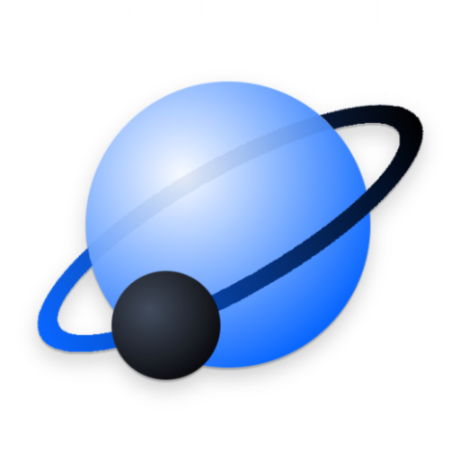

Orbtrack
---

Allows you to discover where many of the objects above earth are at any time and place.
Satellites, rocket bodies, debris, planets, the moon, the international space station, and some stars, can be viewed at the time and place of your choosing (past, present, and future). You can view actual position locations using your phone's camera, calculate coordinates and see them on a map, playback future/past position events, or even save the data to be used somewhere else. Does not require an internet connection to perform calculations and no personal data is ever stored outside of your device.

https://play.google.com/store/apps/details?id=com.nikolaiapps.orbtrack

Setup
---

Go to desired folder, then:

git clone https://github.com/calsurferpunk/Orbtrack.git

cd Orbtrack

git checkout develop

Cherry-pick a Commit
---

git fetch https://github.com/calsurferpunk/Orbtrack develop

git cherry-pick <commit number here>

git push
